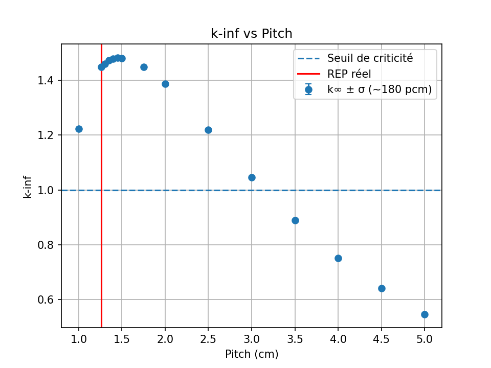
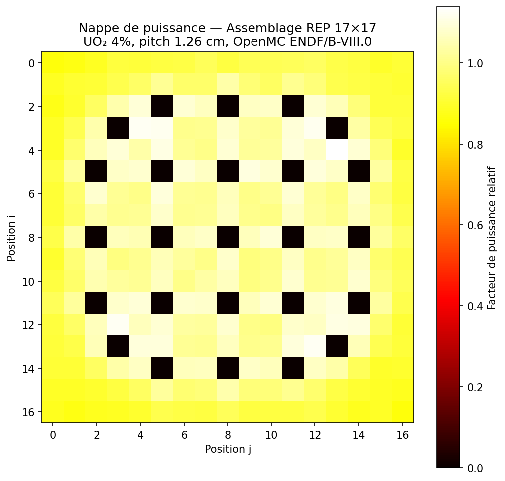
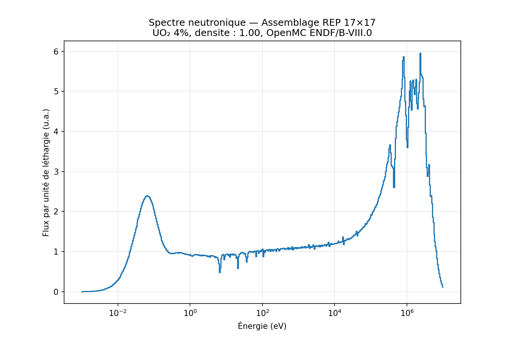
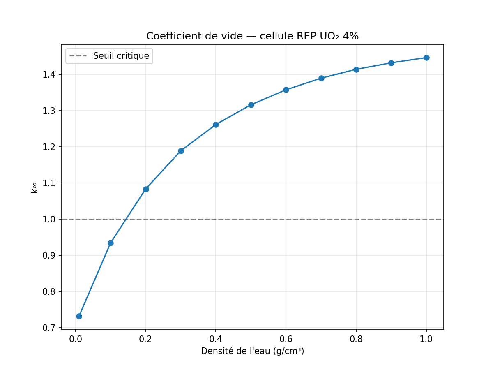
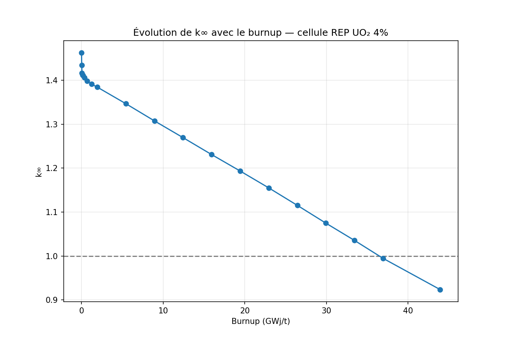
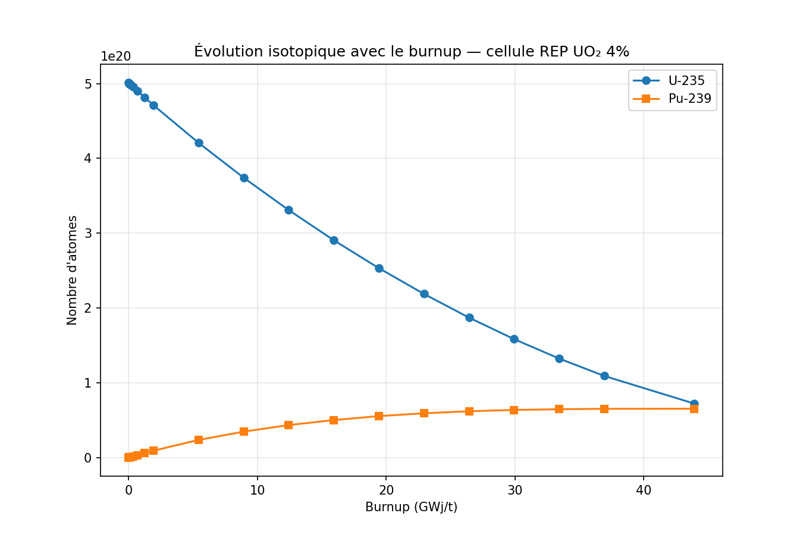
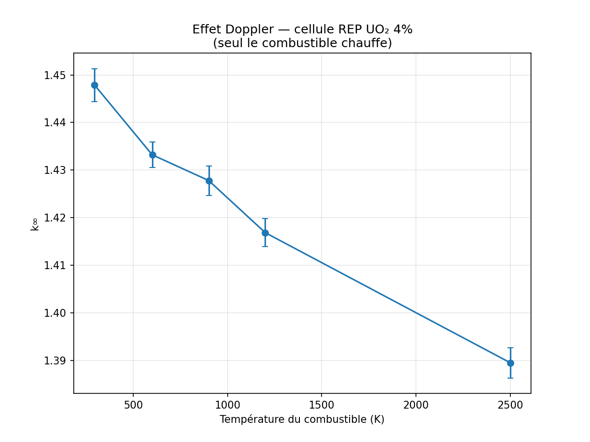
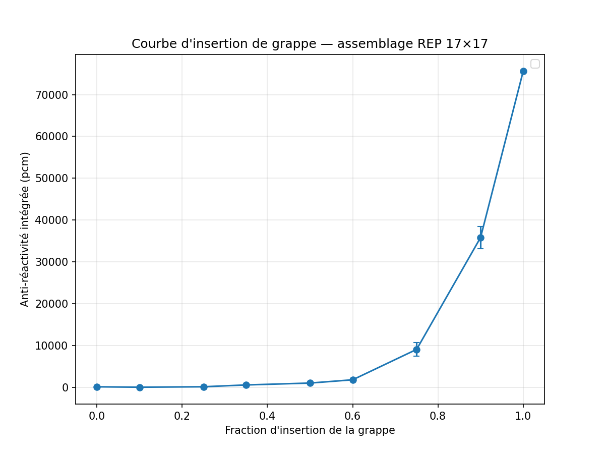
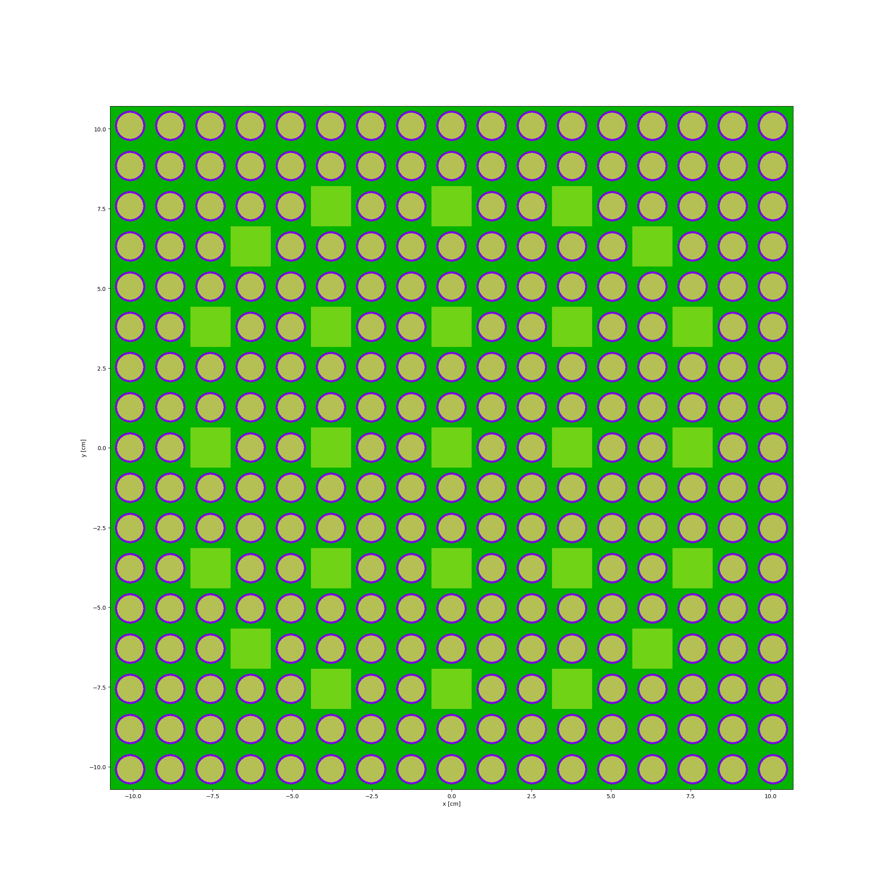

# OpenMC Reactor Physics Studies

A progressive set of Monte Carlo neutronics calculations built with
[OpenMC](https://openmc.org), exploring the core physics of light-water
reactor lattices. Built as a self-directed learning project to demonstrate
reactor-physics reasoning and Monte Carlo modelling skills.

**Nuclear data:** ENDF/B-VIII.0 (continuous-energy HDF5 library)

## Overview

Each script is a self-contained study, ordered from a bare critical mass
up to a full PWR-type assembly with reactivity-coefficient analysis.

| File | Study | Key result |
|------|-------|-----------|
| `01_sphere.py` | Bare enriched-uranium metal sphere | k-effective vs radius; leakage-dominated criticality |
| `02_cylinder.py` | UO₂ pin cell (fuel / Zr clad / water) | Infinite-lattice k∞ with thermal scattering S(α,β) |
| `03_cylinder_kinf.py` | Moderation study: k∞ vs lattice pitch | Bell-shaped curve; confirms PWR pin is under-moderated |
| `04_cylinder_grid_3x3.py` | 3×3 lattice with a central water hole | Universe nesting; local moderation effect |
| `05_LWR_assembly_17x17.py` | 17×17 PWR-type assembly | Power map, neutron spectrum, void coefficient |
| `06_depletion.py` | Fuel depletion / burnup | k∞ vs burnup to ~44 GWd/t; xenon transient |
| `07_doppler.py` | Fuel-temperature (Doppler) coefficient | Negative coefficient ≈ −1.6 pcm/K |
| `08_control_rod.py` | Control-rod worth (3D) | Rod-insertion reactivity curve |

## Physics highlights

### Moderation curve (`03`)

k∞ as a function of pitch shows a maximum near ~1.5 cm. The standard PWR
pitch (1.26 cm) sits to the left of this peak, confirming that LWR lattices
are deliberately *under-moderated* — the basis of a negative moderator/void
coefficient.



### Power map (`05`)

A mesh-tallied fission-rate map of the assembly reveals power peaking in the
fuel pins adjacent to the water-filled guide tubes, where local thermalisation
is enhanced. Radial peaking factor ≈ 1.14.



### Neutron spectrum (`05`)

Flux per unit lethargy shows the three expected regions: the fast fission
bump (~1 MeV), the 1/E slowing-down plateau, and the thermal peak (~0.025 eV).
U-238 resonance dips are visible in the epithermal range.



### Void coefficient (`05`)

Sweeping moderator density from 1.0 to ~0.01 g/cm³ gives a strongly negative
reactivity change, confirming the passive-safety behaviour of under-moderated
light-water lattices. The response is non-linear, reflecting movement along
the moderation curve.



### Burnup (`06`)

Coupled transport–depletion of a UO₂ pin cell at ~35 W/g over ~950 days
(~44 GWd/t). k∞ shows the characteristic sharp initial drop from xenon-135
build-up to equilibrium, followed by a near-linear decline as U-235 is
consumed (partially offset by Pu-239 breeding). The cell crosses k=1 near
~37 GWd/t — a realistic discharge burnup in infinite-lattice terms.





U-235 depletes monotonically (~85 % consumed at 44 GWd/t) while Pu-239
builds up from zero and saturates near ~25 GWd/t as production (U-238 capture)
balances destruction. This breeding is what flattens the k∞ decline.

### Doppler coefficient (`07`)

Heating only the fuel from 294 K to 2500 K (cladding and water held at 294 K)
isolates the Doppler effect: thermal broadening of U-238 capture resonances
reduces resonance self-shielding, raising net capture and lowering k∞. The
measured coefficient is ≈ −1.6 pcm/K (294→900 K) — correct sign and order of
magnitude. This is the prompt, intrinsic feedback central to reactor safety.



### Control-rod worth (`08`)

A 3D model (axial vacuum boundaries, H = 365 cm) with B₄C rods inserted from
the top into the 25 guide-tube positions. Integrated anti-reactivity is
plotted against insertion fraction. The curve stays nearly flat for the first
~50 % of insertion — the rod tip travels through the low-flux upper region —
then rises steeply as it reaches the high-flux core centre, illustrating how
local rod worth tracks the axial flux shape.


## Running

```bash
conda activate openmc-env
python 01_sphere.py
```

Each script is self-contained and runs independently. Depletion (`06`)
additionally requires an ENDF/B-VIII.0 depletion-chain XML, referenced via
`openmc.config['chain_file']` at the top of the script.

## Modelling assumptions and limitations

This is a learning project, not a validated production model. Simplifications:

- Cold conditions (water at 1.0 g/cm³, 294 K) — not the hot operating state
- Pure zirconium cladding (not Zircaloy); no pellet–clad gap modelled
- Studies `01`–`07` use 2D infinite lattices (reflective radial boundaries)
- Guide-tube layout based on a standard French PWR assembly
  (ref: *Exploitation des cœurs REP*, Génie Atomique collection, INSTN);
- Low particle count (1000–2000): trends are reliable, but individual values
  are statistically noisy. The Doppler coefficient (−1.6 pcm/K) is
  order-of-magnitude only; per-point error bars overlap
- Control-rod worth is computed in a radially infinite (reflective) lattice,
  which **overestimates** worth relative to a real core with radial leakage
- Results are not benchmarked against reference criticality data

## Assembly geometry



## Requirements

openmc
numpy
matplotlib
Plus an ENDF/B-VIII.0 HDF5 cross-section library with the
`OPENMC_CROSS_SECTIONS` environment variable set.